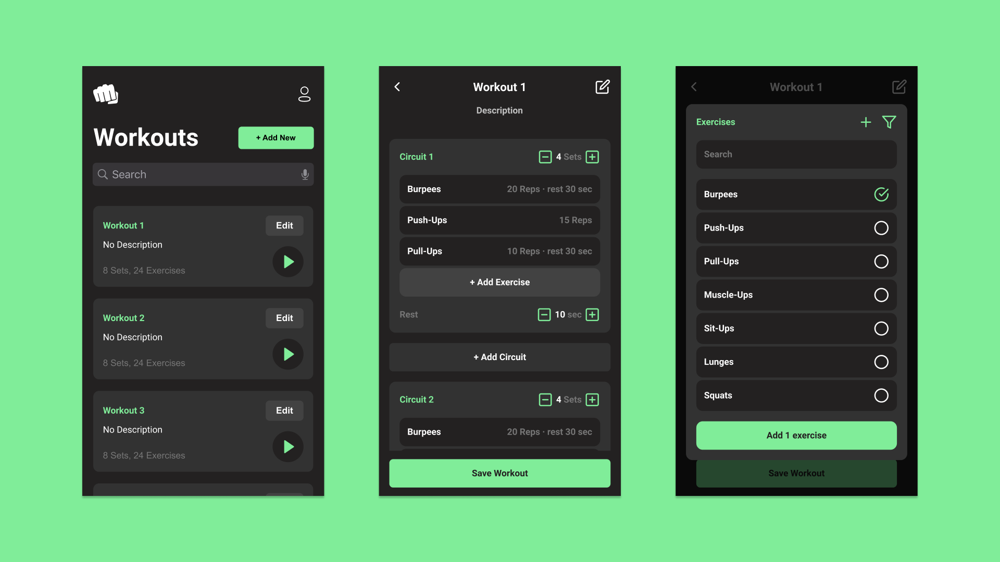

<div align="center">

A web app that lets you create, edit and run workouts. Built with React.js and Typescript.


</div>

---

<br>

## Table of contents

- [Table of contents](#table-of-contents)
- [General Info](#general-info)
- [Screenshots](#screenshots)
- [Technologies](#technologies)
- [Setup](#setup)
- [Features](#features)

## General Info

Crush-It is a workout builder which helps sportsmen build their workouts fast and train easily. In Crush-It you can select either predefined workouts and create your templates or select prefined workout templates. The user is of course able to create his custom workouts as well. Once you have created your custom workout or chosen one of our premade workouts, you are free to train.

This is not a real-world project but the purpose of the project is to gain more technical knowledge in the fields of front-end and back-end. My project partner and I are doing it because we want to become very fast at building MVPs. So The only purpose of the project is to become better and quicker at building MVPs.

## Screenshots



## Technologies

Project is created with:

- Typescript ^4.2.3
- React ^17.0.1
- Node.js ^14.15.3

## Setup

To run this project, install it locally using npm:

```
$ cd ../crush-it-web-app
$ npm install
$ npm start
```

## Features

List of features ready and TODOs for future development

- Create, edit and delete workouts
- Add and modify circuits, exercises and breaks
- Overview workouts on the homepage
- Login and signup
- ...

To-do list:

- Workout player

---

<div align="center">

**This project is built in collaboration with @gio-shara-code**

</div>
